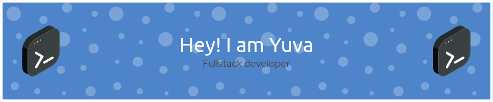

<h3 align="center">:space_invader: &nbsp;About Me</h3>

&nbsp;&nbsp;&nbsp;:technologist: &nbsp;Studied at 42

&nbsp;&nbsp;&nbsp;:seedling: &nbsp;Love for science and innovation.

&nbsp;&nbsp;&nbsp;:heartbeat: &nbsp;Passionate with problem solving.

&nbsp;&nbsp;&nbsp;:hammer_and_wrench: &nbsp;Open for freelance mission as a AI Dev.

  &nbsp;&nbsp;&nbsp;&nbsp;

  
<b>:computer: &nbsp;Main tech knowledge</b>

   

&nbsp;
&nbsp;
&nbsp;
&nbsp;
&nbsp;\
&nbsp;
&nbsp;
&nbsp;
&nbsp;

&nbsp;
&nbsp;
&nbsp;

&nbsp;
&nbsp;
&nbsp;\
&nbsp;

  
<b>:brain: &nbsp;Other knowledge, always learning</b>

   

&nbsp;\
&nbsp;
&nbsp;
&nbsp;
&nbsp;
&nbsp;
